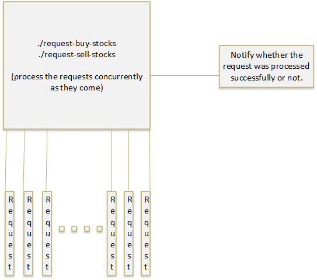
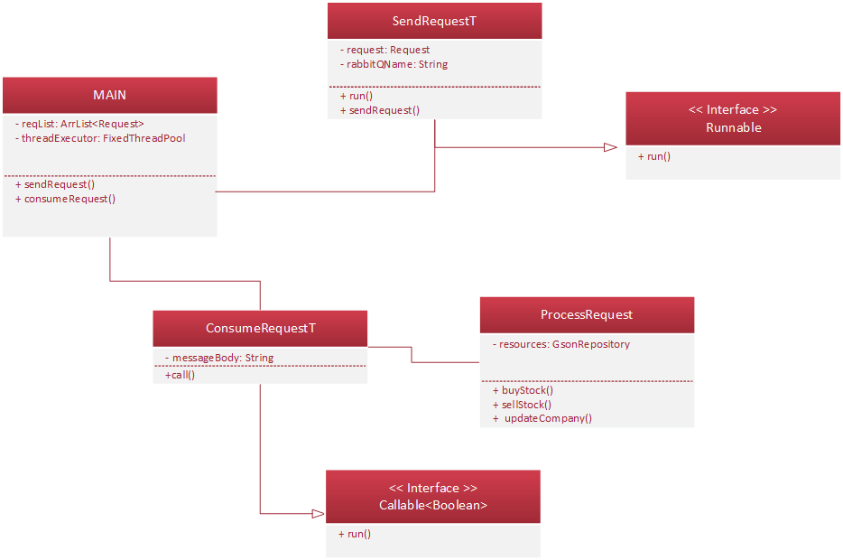

# Concurrency Stock App

-----------------

## **Functional requirements**

------------

•	A user can place a request to sell/buy stocks at a certain price. 

•	A user can see the current price of the stock they’re looking for.

## **Non-functional requirements**

------------


1.	Our service needs to be available 24/7.
2.	It needs to be able to process requests as fast as possible because these influences the prices and difference in prices between price at request time and price at processing/buy time should be as small as possible.
3.	Prices should be updated fast as stocks are bought or sold.
4.	Out of stock or unavailability are possible problems unless a large capacity of stocks are considered (minimum amount set for companies).


## **Concurrency Issues** 

----------------------


```
  Problem: How do we implement a singleton to be thread-safe?
  Answer: We are using a syncronized block on the getIstance method and optimize it by using a local reference instead of using directly the static volatile instance.
```

```
  Problem: How do we simulate a user request/ user response?
  Answer: We are using events, therefore in our application a request is interchangeable with an event. 
          Our preferred framework is RabbitMQ.
```

```
  Problem: How do we solve having multiple threads writting in the repository at the same time(update company)?
  Answer: We are using a ConcurrentHashMap.
```

```
  Problem: How do we solve resource thrashing by too many RabbitMQ channels?
  Answer: We implemented an ObjectPool and instead of closing and recreating channels we acquire and release them back to the ObjectPool.
```
```
  Prolem: How do we manage having different companies requests computed in parallel but the requests on the same company sequentially?
  Answer: We are using the class RequestGate which has a BlockingQueue receiving the requests from the users and by using a HashMap(which is actually a Semaphore for each company) we keep track of which company is processed at the time being. Also we send the requests to be computed in parallel by a cachedThreadPool. (because it is better for fast asyncronous events).
```

```
  Problem: How do we consume Requests and Responses from the RabbiMQ queues?
  Answer: In main we have multiple instances of RequestConsumer and ResponseConsumer which call basic.consume() and therefore consuming in parallel the messages in the queues.
```

```
  Problem: The ObjectPool can be called by multiple threads at the same times, how did we make it thread-safe?
  Answer: Both acquire and release methods are syncrhonized(they have a small trace).
```

```
  Problem: How do we call the method from requestGate which starts the processing of the requests?
  Answer: We have a ScheduledThreadExecutor which is called every 50ms from Main and starts a ThreadPool which processes the requests from the queue with the above mentioned mechanism.
```

## **High-level component design** 

-------------------------------




## **Class diagram**




## TODO

-------------


- [x] modify SendRequest so that each thread has only 1 channel 
- [x] modify SendRequest so that it has only one connection for one Rabbit Queue.
- [x] implement Sell and Buy stocks in ProcessRequest(bzl).
- [x] also write back the new content for the companies in its json.
- [x] make ConsumerRequest return on callback true/false for the processed request of the user.
- [x] solve the serialising issues with futures when calling get() instead of isDone().
- [x] add Log4J depdencies and initial configuration.
- [x] configure logs so that we have a clear order of processing things,
- [x] add Object Pool for both Connections and Channels
- [x] modify requestGenerator so that we have ids for each user
- [x] create UserRepository and users in a json file
- [x] create matching class
- [x] create a new event for Client Response once the Request has been processed


